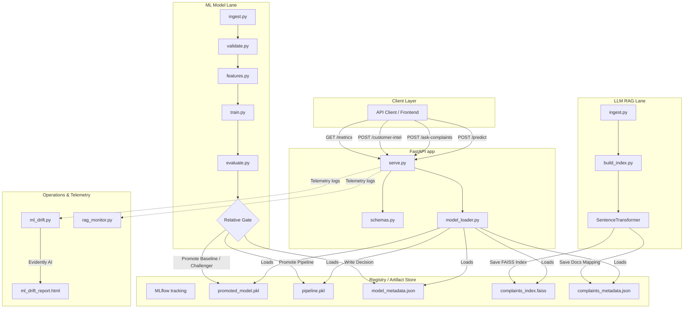

# Customer Intelligence Platform

A production-grade, combined Machine Learning (predicting outreach campaign conversion) and LLM/RAG (answering consumer complaints narrative questions with citations) platform.

## Repository Structure

```
customer-intelligence-platform/
├── .github/
│   └── workflows/
│       └── ci.yml               # CI pipeline running tests and gates
├── data/                        # Local data directory
├── docs/
│   ├── architecture.md          # System Architecture and diagram
│   ├── decision_log.md          # Architecture decisions log
│   ├── RAG_eval.md              # RAG evaluation results
│   └── hardening.md             # Production hardening guide
├── monitoring/
│   ├── ml_drift.py              # Evidently data drift reporter
│   └── rag_monitor.py           # RAG retrieval quality metrics
├── src/
│   ├── data_pipeline/
│   │   ├── ingest.py            # Pulls datasets from UCI & CFPB
│   │   ├── validate.py          # Data validation schema and checks
│   │   └── features.py          # Feature preprocessing pipeline
│   ├── training/
│   │   ├── train.py             # Model training (Baseline & Challenger)
│   │   └── evaluate.py          # Metrics, relative gate & promotion
│   ├── serving/
│   │   ├── serve.py             # FastAPI API Contract Server
│   │   ├── schemas.py           # Pydantic schemas
│   │   └── model_loader.py      # Cache resource loader
│   └── rag/
│       ├── build_index.py       # Embeds & builds FAISS index
│       ├── retrieve.py          # FAISS query and post-filtering
│       ├── answer.py            # Answering engine (Gemini & Mock fallback)
│       └── rag_eval.py          # 10 Q&A tests suite
├── tests/                       # Pytest unit tests
├── Dockerfile                   # FastAPI docker image definition
├── docker-compose.yml           # Multi-container orchestration (App & MLflow UI)
├── requirements.txt             # Project requirements
├── reflection.md                # Post-project reflections
└── deploy_azure.ps1             # PowerShell script for Azure Container Apps
```

## System Architecture & High-Level Design

The system is decoupled into modular layers to prevent train-serving skew and promote operational scalability:



### Component Details
1. **Data Pipeline Component (`src/data_pipeline/`)**: Handles programmatic ingestion of Bank Marketing and CFPB complaints. Schema validator checks rules and category encoding standardizes maps to prevent train-serving skew.
2. **ML Model Lane (`src/training/`)**: Trains baseline (Logistic Regression) and challenger (Random Forest) models. Runs a relative promotion gate requiring PR-AUC to improve by $\ge 2\%$ and F1 drop to be $\le 1\%$, registering the promoted model.
3. **LLM RAG Lane (`src/rag/`)**: Encodes cleaned narratives locally using `SentenceTransformer` (`all-MiniLM-L6-v2`) and indexes them using `FAISS`. Implements metadata post-filtering and refusal logic if similarity falls below `0.35`.
4. **FastAPI Serving Layer (`src/serving/`)**: Unified FastAPI spine with request/response validation (Pydantic) and model loader caching.
5. **Drift & Telemetry (`monitoring/`)**: Statistical data drift checking via **Evidently AI** and live metrics tracking.

---

## Setup & Running

### 1. Prerequisites
- Python 3.10+
- Docker Desktop (Optional, for containerized running)
- Azure CLI (Optional, for cloud deployment)

### 2. Install Dependencies
```powershell
python -m venv .venv
.venv\Scripts\activate.ps1
pip install -r requirements.txt
```

### 3. Ingest Data
Downloads UCI Bank Marketing (10% sample) and 5,000 CFPB Complaints narratives:
```powershell
python src/data_pipeline/ingest.py
```

### 4. Run ML Model Training & Gate Promotion
Trains baseline and challenger models, tracks metrics in MLflow, and evaluates the relative gate (PR-AUC +2% improvement, F1 drop <= 1%):
```powershell
python src/training/train.py
python src/training/evaluate.py
```

### 5. Build RAG Vector Index
Embeds narratives locally using `all-MiniLM-L6-v2` and indexes them using FAISS:
```powershell
python src/rag/build_index.py
```

### 6. Run FastAPI Server
Launches the serving layer locally:
```powershell
uvicorn src.serving.serve:app --reload
```
Go to `http://127.0.0.1:8000/docs` to interact with Swagger UI.

### 7. Run Evaluation & Tests
- **RAG QA Tests**: Runs the 10 evaluation questions and writes reports to `docs/RAG_eval.md`:
  ```powershell
  python src/rag/rag_eval.py
  ```
- **ML Drift Report**: Generates Evidently HTML report inside `docs/ml_drift_report.html`:
  ```powershell
  python monitoring/ml_drift.py
  ```
- **Unit Tests**:
  ```powershell
  pytest
  ```

## Docker & Compose Setup
Run both FastAPI application and MLflow Dashboard:
```powershell
docker-compose up --build
```
- FastAPI Server: `http://localhost:8000`
- MLflow Dashboard UI: `http://localhost:5000`

## Cloud Deployment (Azure)
To deploy to Azure Container Apps:
```powershell
.\deploy_azure.ps1
```
Ensure you have configured a `.env` file with `GEMINI_API_KEY` to enable real LLM generation on the cloud.
