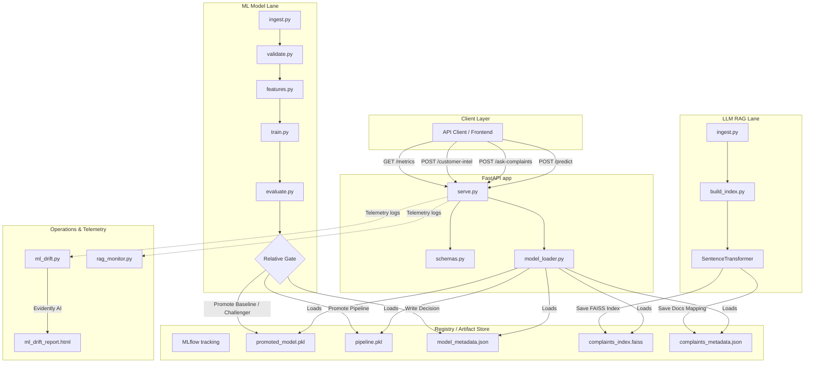

# High-Level Design (HLD) - Customer Intelligence Platform

**Document Version**: 1.0.0  
**Target Scenario**: Meridian Financial Smart Outreach & Complaint Resolution  
**Author**: Antigravity AI  
**Date**: May 24, 2026  

---

## 1. Introduction

### 1.1 Goal
Meridian Financial wants to run smarter outreach campaigns and resolve complaints at scale. The **Customer Intelligence Platform** provides a production-grade infrastructure that combines a classical ML classifier (campaign conversion scoring) and an LLM/RAG engine (grounded complaint narratives Q&A) behind a unified FastAPI production spine.

### 1.2 Scope
- **ML Classifier**: Binary classification to predict customer campaign subscription (UCI Bank Marketing dataset).
- **LLM/RAG Assistant**: Semantic search and grounded Q&A over consumer complaint narratives (CFPB Database).
- **MLOps/LLMOps Pipelines**: Automated data validation, relative model gating, tracking, containerization, drift monitoring, and Azure deployment.

---

## 2. High-Level Architecture Diagram

The system is decoupled into modular layers to prevent train-serving skew and promote operational scalability:

---

## 3. Component Details

### 3.1 Data Pipeline Component
- **Data Ingestor (`ingest.py`)**: Downloads datasets programmatically. Handles expired SSL endpoints securely (`verify=False`) and utilizes page-by-page chunked downloads (1,000 records/page) to prevent public API connection drops. Falls back to a mock database generator to maintain offline testability.
- **Data Validator (`validate.py`)**: Checks dataset column structures, missing values, duplicates, and verifies at least 5 business rules (e.g., valid age ranges, non-negative contact durations, correct targets) to ensure data sanity.
- **Features Pipeline (`features.py`)**: Centralizes preprocessing (scaling, imputation, and category one-hot mapping). Implements `BankMarketingFeaturePipeline` which standardizes feature maps to prevent **train-serving skew** during live API scoring.

### 3.2 ML Model Lane (Conversion Classifier)
- **Model Training (`train.py`)**: Trains a Baseline model (Logistic Regression) and a Challenger model (Random Forest Classifier). Metrics are tracked locally in MLflow.
- **Relative Promotion Gate (`evaluate.py`)**: Evaluates challenger metrics against the baseline. Challenger is promoted **only if**:
  1. $\text{PR-AUC}_{\text{challenger}} - \text{PR-AUC}_{\text{baseline}} \ge 2\%$.
  2. $\text{F1}_{\text{baseline}} - \text{F1}_{\text{challenger}} \le 1\%$.
  Promoted assets are copied to the registry folder along with their configuration metrics cataloged in `model_metadata.json`.

### 3.3 LLM RAG Lane (Complaint Resolving Assistant)
- **Indexing (`build_index.py`)**: Encodes cleaned narratives using local `SentenceTransformer` (`all-MiniLM-L6-v2`) to generate 384-dimensional dense vectors, indexing them via `faiss.IndexFlatIP` (normalized for cosine similarity).
- **Retrieval & Filtering (`retrieve.py`)**: Queries the FAISS index. Implements metadata post-filtering (on product, company, date, issue) utilizing a larger candidate scanner window to avoid filtering misses.
- **Answering Engine (`answer.py`)**: Computes cosine similarity of the top retrieved complaint. If similarity is $< 0.35$, the query is refused (*"I cannot answer this question..."*) to prevent halluncinations. Integrates with the Gemini API (using `google.generativeai`) with a local deterministic Mock LLM fallback.

### 3.4 Serve Component (FastAPI Layer)
- **Resource Cache (`model_loader.py`)**: Implements a singleton cache loader that pre-loads models and vector indices on startup, preventing redundant disk reads.
- **Endpoints (`serve.py`)**: Exposes:
  - `GET /health`: System health check.
  - `POST /predict`: Outreach campaign classification.
  - `POST /batch-score`: Chunked file-level scoring.
  - `POST /ask-complaints`: Grounded complaints Q&A with cited IDs.
  - `POST /customer-intel`: Dual lane integration returning conversion bands and complaint themes in a single call.
  - `GET /metrics`: Latency, request counts, prediction distributions, and RAG stats.

---

## 4. Telemetry & Operations

### 4.1 Statistical Drift Monitoring (`ml_drift.py`)
- Employs **Evidently AI** to check for data drift. Compares live scoring features against the baseline training distribution using statistical tests (Kolmogorov-Smirnov and Chi-Square). Outputs interactive dashboards to `docs/ml_drift_report.html`.

### 4.2 Telemetry Tracking
- Tracks average endpoint latencies, positive-to-negative class ratios, retrieval hit rates, and refusal rates in-memory, exposed directly under the `/metrics` endpoint.

---

## 5. Deployment Layout

- **CI/CD (`.github/workflows/ci.yml`)**: Automates testing, schema validation, mock training, and gating checks on every push and pull request.
- **Containerization (`Dockerfile`, `docker-compose.yml`)**: Packages the serving app on port `8000` and configures a separate container hosting the MLflow Tracking Server on port `5000`.
- **Azure Deployment (`deploy_azure.ps1`)**: Automates setup of Resource Group, Azure Container Registry (ACR), and Azure Container Apps (ACA) using the Azure CLI.
